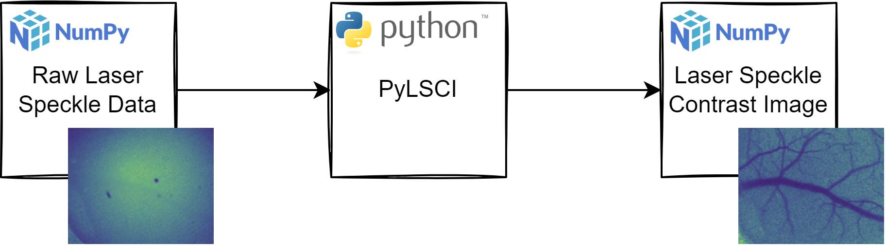

# PyLSCI

[](https://github.com/psf/black)


[](https://pepy.tech/project/pylsci)
[](https://mybinder.org/v2/gh/pkeilbach/pylsci/HEAD?labpath=binder%2Fdemo.ipynb)

A [Python package](https://pypi.org/project/pylsci/) for Laser Speckle Contrast Imaging.

It converts raw laser speckle data (as 2D or 3D NumPy arrays) to laser speckle contrast images (a 2D NumPy array).



Check out the demo notebook at [mybinder.org](https://mybinder.org/v2/gh/pkeilbach/pylsci/HEAD?labpath=binder%2Fdemo.ipynb)

---

The code for this package was developed for my thesis on [Fingerprint Presentation Attack Detection using Laser Speckle Contrast Imaging](https://www.researchgate.net/publication/329391997_Fingerprint_Presentation_Attack_Detection_using_Laser_Speckle_Contrast_Imaging):

- Keilbach, P., Kolberg, J., Gomez-Barrero, M., Busch, C., & Langweg, H. (2018). Fingerprint Presentation Attack Detection using Laser Speckle Contrast Imaging. International Conference of the Biometrics Special Interest Group (BIOSIG), Darmstadt, 2018, pp. 1-6, doi: https://10.23919/BIOSIG.2018.8552931.

## Quickstart

To work with this package, you need to have you laser speckle images available as 2D or 3D NumPy arrays:

- For spatial contrast calculation, PyLSCI expects ayour raw laser speckle data as 2D NumPy Arrays.
- For temporal or spatio-temporal contrast calculation, PyLSCI expects your raw laser speckle data a time series raw laser speckle data as a 3D NumPy Array, where the first dimension is the temporal domain.

The process of converting the raw laser speckle images to NumPy arrays is out of scope of the PyLSCI, since this process is highly dependent on a particular LSCI setup. So you may need a custom helper module to do that job for you.

> For a more detailed documentation, please see the [Jupyter Notebook `demo.ipynb`](https://github.com/pkeilbach/pylsci/blob/develop/demo.ipynb) that is provided in this GitHub project.

### 0. Preparation

```sh
pip install pylsci
```

### 1. Preparation

PyLSCI assumes you have your raw laser speckle data available as NumPy arrays.
Depending on your sensor setup, you may need to convert your raw laser speckle data to NumPy arrays.
You would usually have that functionality encapsulated in a custom utils module, as indicated here with `my_utils`.

```python
from my_utils import convert_speckle_to_numpy

# spatial laser speckle images are expected to be a 2D NumPy array.
speckle_img = convert_speckle_to_numpy('img/spatial.tif')

# temporal laser specke image series are expected to be 3D NumPy arrays,
# where the first dimension is the temporal domain
speckle_img_sequence = convert_speckle_to_numpy('img/temporal.png', temporal_series=True)
```

### 2. Create a Lsci Object

Values for spatial and temporal neighborhoos arguments are optional.
They default to `nbh_s=3` and `nbh_t=25`.
Note that nbh_s needs to be an odd value, but there is no constraint for nbh_t

```python
from pylsci import Lsci

lsci = Lsci(nbh_s=5, nbh_t=40)
```

### 3. Calculate the Laser Speckle Contrast Images

#### 3.1 Spatial Contrast Calculation

The spatial contrast calculation requires a single laser speckle image as a NumPy 2D array and returns a single laser speckle contrast image as a 2D NumPy array.

```python
s_lsci = lsci.spatial_contrast(speckle_img)
```

#### 3.2 Temporal Contrast Calculation
The temporal and spatio-temporal contrast calculation require a 3D NumPy array (time series of laser speckle images) and will return a single (averaged) laser speckle contrast image as a 2D NumPy array.

```python
# temporal contrast calculation
t_lsci = lsci.temporal_contrast(speckle_img_sequence)

# spatio-temporal contrast calculation
st_lsci = lsci.spatio_temporal_contrast(speckle_img_sequence)
```

## Dependencies

The PyLSCI packages depends on [NumPy](https://numpy.org/),
which is is used to do all the array related calculations.

## Implementation Details

Note that the window iterations of the 2D arrays are not (yet) optimized.

The `temporal_contrast()` method performs quite well, since NumPy allows to calculate the standard deviation and mean along the temporal axis for the whole array.

This is not the case for the `spatial_contrast()` and `spatio_temporal_contrast()` methods,
where the implementations rely on inefficient, nested loops.

Please be aware of this as calculating the contrast with the `spatial_contrast()` and `spatio_temporal_contrast()` methods may take a long time.


## Further Reading

To understand the theory and concepts of LSCI, the following papers are recommended:

- Boas, D. A., & Dunn, A. K. (2010). Laser speckle contrast imaging in biomedical optics. Journal of biomedical optics, 15(1), 011109. https://doi.org/10.1117/1.3285504
- Briers, D., Duncan, D. D., Hirst, E., Kirkpatrick, S. J., Larsson, M., Steenbergen, W., Stromberg, T., & Thompson, O. B. (2013). Laser speckle contrast imaging: theoretical and practical limitations. Journal of biomedical optics, 18(6), 066018. https://doi.org/10.1117/1.JBO.18.6.066018
- Senarathna, J., Rege, A., Li, N., & Thakor, N. V. (2013). Laser Speckle Contrast Imaging: theory, instrumentation and applications. IEEE reviews in biomedical engineering, 6, 99–110. https://doi.org/10.1109/RBME.2013.2243140
- Vaz, P. G., Humeau-Heurtier, A., Figueiras, E., Correia, C., & Cardoso, J. (2016). Laser Speckle Imaging to Monitor Microvascular Blood Flow: A Review. IEEE reviews in biomedical engineering, 9, 106–120. https://doi.org/10.1109/RBME.2016.2532598
